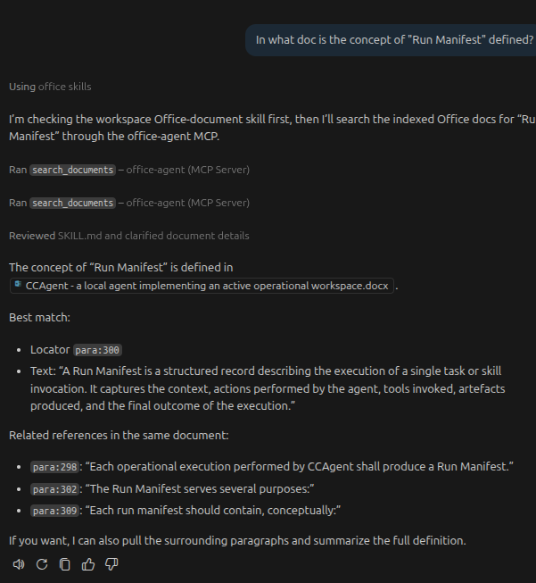

# Office-Agent
[](https://www.python.org/)
[](https://gofastmcp.com/getting-started/welcome)
[](LICENSE)
[](FOSS_PLURALISM_MANIFESTO.md)
[](https://openspec.dev/)

Office-Agent (`offagent`) is a local-first Office document tool with a shared application core and a CLI entrypoint, `office-agent`.


The project is being built incrementally. The current implementation includes:

- project configuration and environment diagnostics
- allowed-root and output-root path guards for read and write workflows
- a local SQLite + FTS5 index
- optional embedding-backed semantic and hybrid search over indexed items
- DOCX paragraph extraction and indexing
- DOCX search, locate, read, replace, and append operations
- PPTX text-shape extraction and indexing
- PPTX search, locate, read, replace, and append operations
- XLSX cell extraction and indexing
- XLSX search, locate, read, write-cell, and guarded append operations
- indexed document summaries with `list` and `show`
- shared human-readable, JSON, and quiet CLI output modes
- versioned write outputs with automatic reindexing
- stale-locator detection for write commands
- an MCP server over stdio implemented with FastMCP

Current scope is intentionally narrow. DOCX, PPTX, and XLSX are the currently implemented document formats. The MCP surface currently supports stdio transport only.

## Current Features

### Base App

- `office-agent doctor` checks required imports, SQLite availability, FTS5 support, index path writability, configured document roots, and configured path-policy roots
- configuration loads from a TOML file with environment variable overrides
- Office file discovery supports `.docx`, `.pptx`, and `.xlsx` roots at the base layer
- allowed-root policy protects index, show, locate, read, and search-by-document workflows
- output-root policy protects versioned and in-place write targets
- optional embedding generation can be enabled during indexing and reindexing
- search supports `keyword`, `semantic`, and `hybrid` modes; `keyword` remains the default
- write commands default to versioned output files and automatic reindexing

### DOCX Workflow

- index a `.docx` file or a directory of `.docx` files
- reindex a changed `.docx` file
- search indexed DOCX paragraph content through SQLite FTS5
- locate a paragraph directly by paragraph number
- read the current paragraph text from the source document
- replace a paragraph while preserving the first run's character formatting
- append text to the last run of a paragraph, or create a run for an empty paragraph
- write versioned output files by default, with optional in-place overwrite when explicitly enabled

DOCX indexing uses paragraph-level item ids in the form `para:<n>`. Empty paragraphs are included so paragraph numbering stays stable.

### PPTX Workflow

- index a `.pptx` file or a directory of supported Office files
- search indexed PowerPoint text-frame content through SQLite FTS5
- locate editable text-bearing shapes by slide number, with optional shape id narrowing
- read the current text-frame content from the source presentation
- replace the full text-frame content of one shape
- append text to an existing editable text frame
- write versioned output files by default, with optional in-place overwrite when explicitly enabled

PPTX indexing uses shape-level item ids in the form `slide:<n>:shape:<id>`. Only shapes with text frames are indexed. Tables, charts, images, SmartArt, and other non-text shapes are excluded, and PPTX write attempts to those targets fail with `target not editable`.

### XLSX Workflow

- index an `.xlsx` file or a directory of supported Office files
- reindex a changed `.xlsx` file
- search indexed workbook cell content through SQLite FTS5
- generate contextual embedding text for indexed cells when embedding indexing is enabled
- locate a cell directly by worksheet name and coordinate
- read the current cell value or formula text from the source workbook
- write one cell value directly with `write-cell`
- append text only to empty or string-compatible cells
- write versioned output files by default, with optional in-place overwrite when explicitly enabled

XLSX indexing uses cell-level item ids in the form `sheet:<name>!<coordinate>`. Only non-empty cells are indexed. Formula cells are indexed by formula text, and append attempts to numeric or formula cells fail with an error directing the user to `write-cell`.

### MCP Server

- start the MCP server with `office-agent mcp`
- stdio transport is implemented for MCP-compatible clients
- exposed MCP tools are `index_documents`, `refresh_document`, `list_documents`, `search_documents`, `locate_item`, `read_item`, `replace_text`, `append_text`, and `write_cell`
- MCP requests reuse the shared application configuration and service layer rather than duplicating document logic
- MCP responses are structured, and expected service failures are returned as MCP tool errors

### Vector Search

- index and reindex can optionally generate one embedding per indexed item with `--with-embeddings`
- embeddings are stored in SQLite sidecar tables keyed by the existing indexed item identity
- semantic search embeds the query and compares it against stored vectors
- hybrid search merges FTS hits and semantic hits with deterministic weighted ranking
- search results include `match_mode` and per-source `scores` metadata in JSON and MCP output
- `office-agent doctor` verifies embedding-provider importability, model loadability, and embedding-store consistency

## Installation

The project uses `uv` in development.

```bash
uv sync
```

Run the CLI with:

```bash
uv run office-agent --help
```

## Configuration

The CLI accepts an optional config file via `--config <path>`.

Example `office-agent.toml`:

```toml
[offagent]
index_path = ".offagent/index.sqlite3"
document_roots = ["./docs"]
allowed_roots = ["./docs", "./edited"]
output_directory = "./edited"
output_roots = ["./edited", "./docs"]
allow_inplace_overwrite = false
embedding_model = "BAAI/bge-small-en-v1.5"
embedding_dimensions = 384
vector_search_top_k = 20
hybrid_keyword_weight = 0.4
hybrid_semantic_weight = 0.6
```

Environment variables override file settings:

- `OFFAGENT_CONFIG`
- `OFFAGENT_INDEX_PATH`
- `OFFAGENT_DOCUMENT_ROOTS`
- `OFFAGENT_ALLOWED_ROOTS`
- `OFFAGENT_OUTPUT_DIRECTORY`
- `OFFAGENT_OUTPUT_ROOTS`
- `OFFAGENT_ALLOW_INPLACE_OVERWRITE`
- `OFFAGENT_EMBEDDING_MODEL`
- `OFFAGENT_EMBEDDING_DIMENSIONS`
- `OFFAGENT_VECTOR_SEARCH_TOP_K`
- `OFFAGENT_HYBRID_KEYWORD_WEIGHT`
- `OFFAGENT_HYBRID_SEMANTIC_WEIGHT`

`OFFAGENT_DOCUMENT_ROOTS` uses the platform path separator, for example `:` on macOS/Linux.

Configuration fields:

- `index_path`: SQLite index file location
- `document_roots`: directories scanned by discovery and directory-based indexing
- `allowed_roots`: canonical roots allowed for indexed read operations; empty means no read guard
- `output_directory`: optional directory for versioned write outputs; defaults to the source document directory
- `output_roots`: canonical roots allowed for write outputs; if omitted and `output_directory` is set, this defaults to that directory
- `allow_inplace_overwrite`: when `true`, write commands may use `--output-mode inplace`; default is `false`
- `embedding_model`: embedding model name used when generating or querying vectors
- `embedding_dimensions`: expected vector dimensionality for the configured model
- `vector_search_top_k`: candidate pool size used by semantic and hybrid retrieval
- `hybrid_keyword_weight`: keyword contribution to hybrid ranking
- `hybrid_semantic_weight`: semantic contribution to hybrid ranking

## CLI

All commands accept `--config <path>` after the command name. Example:

```bash
uv run office-agent search "supplier shall" --config office-agent.toml
```

Structured commands also accept:

- `--json`: emit machine-readable JSON with no extra prose
- `--quiet`: suppress successful stdout output

`--json` and `--quiet` are mutually exclusive.

Write commands also accept `--output-mode <mode>` where `<mode>` is:

- `versioned`: default; writes `<name>.edited.<timestamp>.<ext>` and reindexes the new file
- `inplace`: overwrites the source file, but only if `allow_inplace_overwrite = true`

Common exit codes:

- `0`: success
- `1`: other runtime failure
- `2`: invalid arguments or incompatible flag combinations
- `3`: not-found target, missing indexed item/document, or stale-locator write failure
- `4`: not-editable target
- `5`: policy-refused operation

### Doctor

Checks runtime health, including vector-search readiness.

Options:

- `--config <path>`: optional config file path

```bash
uv run office-agent doctor
uv run office-agent doctor --config office-agent.toml
```

### Index And Reindex

`index` indexes one file or all supported Office files under a directory. `reindex` currently re-runs the same indexing flow. Add `--with-embeddings` to generate and persist embeddings during the run.

Arguments:

- `path`: file or directory to index

Options:

- `--with-embeddings`: generate embeddings for indexed items during this run
- `--config <path>`: optional config file path

```bash
uv run office-agent index ./docs
uv run office-agent index ./docs --with-embeddings
uv run office-agent index ./docs/sample.docx
uv run office-agent index ./docs/sample.pptx
uv run office-agent index ./docs/sample.xlsx
uv run office-agent reindex ./docs/sample.docx
uv run office-agent reindex ./docs/sample.docx --with-embeddings
uv run office-agent reindex ./docs/sample.pptx
uv run office-agent reindex ./docs/sample.xlsx
```

### Search

Searches indexed content through SQLite FTS5, stored embeddings, or both.

Arguments:

- `query`: search text

Options:

- `--type <docx|pptx|xlsx>`: restrict search to one document type
- `--doc <path>`: restrict search to one indexed document path
- `--mode <keyword|semantic|hybrid>`: retrieval mode; default `keyword`
- `--config <path>`: optional config file path

```bash
uv run office-agent search "supplier shall"
uv run office-agent search "supplier shall" --mode semantic
uv run office-agent search "supplier shall" --mode hybrid --json
uv run office-agent search "supplier shall" --type docx
uv run office-agent search "supplier shall" --type pptx
uv run office-agent search "supplier shall" --type xlsx
uv run office-agent search "supplier shall" --type docx --doc ./docs/sample.docx
uv run office-agent search "supplier shall" --type pptx --doc ./docs/sample.pptx
uv run office-agent search "supplier shall" --type xlsx --doc ./docs/sample.xlsx
```

Notes:

- `keyword` behaves like the original FTS-only search path
- `semantic` requires prior indexing with `--with-embeddings`
- `hybrid` combines keyword and semantic candidates and returns merged ranking metadata
- JSON output includes `match_mode` and `scores`; semantic and hybrid human-readable output also displays that metadata

### List

Lists indexed documents with document id, path, type, modified time, and indexed item count.

```bash
uv run office-agent list
uv run office-agent list --json
```

### Show

Shows one indexed document summary, or one indexed item within that document.

```bash
uv run office-agent show --doc ./docs/sample.docx
uv run office-agent show --doc ./docs/sample.docx --item para:3
uv run office-agent show --doc ./docs/sample.xlsx --item sheet:Budget2026!B12 --json
```

### Locate

Resolves a direct item reference for one document.

Options:

- `--doc <path>`: required document path
- `--paragraph <n>`: DOCX-only paragraph lookup
- `--slide <n>`: PPTX-only slide lookup
- `--shape <id>`: optional PPTX shape narrowing; only valid with `--slide`
- `--sheet <name>`: XLSX-only worksheet lookup
- `--cell <coordinate>`: XLSX-only cell coordinate; only valid with `--sheet`
- `--config <path>`: optional config file path

Valid option combinations:

- DOCX: `--doc` + `--paragraph`
- PPTX: `--doc` + `--slide` with optional `--shape`
- XLSX: `--doc` + `--sheet` + `--cell`

```bash
uv run office-agent locate --doc ./docs/sample.docx --paragraph 3
uv run office-agent locate --doc ./docs/sample.pptx --slide 1
uv run office-agent locate --doc ./docs/sample.pptx --slide 1 --shape 7
uv run office-agent locate --doc ./docs/sample.xlsx --sheet Budget2026 --cell B12
```

### Read

Reads the current source content for one indexed item.

Options:

- `--doc <path>`: required document path
- `--item <item-id>`: required item id
- `--config <path>`: optional config file path

```bash
uv run office-agent read --doc ./docs/sample.docx --item para:3
uv run office-agent read --doc ./docs/sample.pptx --item slide:1:shape:7
uv run office-agent read --doc ./docs/sample.xlsx --item sheet:Budget2026!B12
```

### Replace

Replaces the full text of one DOCX paragraph or PPTX text shape.

Options:

- `--doc <path>`: required document path
- `--item <item-id>`: required item id
- `--text <value>`: replacement text
- `--output-mode <versioned|inplace>`: write mode; default `versioned`
- `--config <path>`: optional config file path

Notes:

- `replace` is supported for DOCX and PPTX only
- XLSX uses `write-cell` instead of `replace`

```bash
uv run office-agent replace --doc ./docs/sample.docx --item para:3 --text "Updated paragraph text."
uv run office-agent replace --doc ./docs/sample.pptx --item slide:1:shape:7 --text "Updated slide text."
uv run office-agent replace --doc ./docs/sample.docx --item para:3 --text "Updated paragraph text." --output-mode versioned
```

### Append

Appends text to one supported target.

Options:

- `--doc <path>`: required document path
- `--item <item-id>`: required item id
- `--text <value>`: appended text
- `--output-mode <versioned|inplace>`: write mode; default `versioned`
- `--config <path>`: optional config file path

Notes:

- DOCX appends to the target paragraph
- PPTX appends to the target text frame
- XLSX appends only to empty or string-compatible cells
- stale-locator failures exit with code `3`

```bash
uv run office-agent append --doc ./docs/sample.docx --item para:3 --text " Additional text."
uv run office-agent append --doc ./docs/sample.pptx --item slide:1:shape:7 --text "\nAdditional slide text."
uv run office-agent append --doc ./docs/sample.xlsx --item sheet:Notes!A1 --text " Additional note."
```

### Write Cell

Writes one XLSX cell value directly.

Options:

- `--doc <path>`: required `.xlsx` document path
- `--sheet <name>`: required worksheet name
- `--cell <coordinate>`: required cell coordinate
- `--value <value>`: new cell value
- `--output-mode <versioned|inplace>`: write mode; default `versioned`
- `--config <path>`: optional config file path

```bash
uv run office-agent write-cell --doc ./docs/sample.xlsx --sheet Budget2026 --cell B12 --value "125000"
uv run office-agent write-cell --doc ./docs/sample.xlsx --sheet Budget2026 --cell B12 --value "125000" --output-mode inplace
```

### MCP

Starts the FastMCP server on stdio.

Options:

- `--config <path>`: optional config file path

```bash
uv run office-agent mcp
uv run office-agent mcp --config office-agent.toml
```

The MCP server exposes these tools:

- `index_documents(paths)`
- `refresh_document(document_id)`
- `list_documents()`
- `search_documents(query, file_type=None, document_id=None, mode="keyword", limit=20)`
- `locate_item(document_id, locator)`
- `read_item(document_id, item_id)`
- `replace_text(document_id, item_id, new_text, output_mode="versioned")`
- `append_text(document_id, item_id, text_to_add, output_mode="versioned")`
- `write_cell(document_id, sheet, cell, value, output_mode="versioned")`

## Example query session



## Item Id Reference

Use these item-id formats with `read`, `replace`, and `append`:

- DOCX: `para:<n>`
- PPTX: `slide:<slide-number>:shape:<shape-id>`
- XLSX: `sheet:<worksheet-name>!<cell-coordinate>`

## Write Behavior

By default, all write commands create a versioned output file:

- `sample.docx` -> `sample.edited.20260318-214512345678.docx`
- `deck.pptx` -> `deck.edited.20260318-214512345678.pptx`
- `budget.xlsx` -> `budget.edited.20260318-214512345678.xlsx`

After a successful write:

- the output file is automatically reindexed
- CLI output reports the written output path
- search results can resolve against the new version immediately
- managed output roots are treated as readable workflow roots so versioned-write follow-up commands continue to work

If the source file changed after indexing:

- the service compares the current file hash to the indexed `content_hash`
- it tries to re-resolve the same item id against the current file
- if that fails, the command exits with stale-locator error code `3`

## Development

Run the test suite with:

```bash
uv run pytest
```

This repository also includes an example skill for Office-document workflows at [`.github/skills/office-agent`](./.github/skills/office-agent/). The location is VSCode specific but it should work for Claude Code and Codex as well.  

Acceptance coverage uses checked-in golden Office fixtures under [`tests/fixtures`](./tests/fixtures/), including DOCX, PPTX, and XLSX documents exercised by the CLI and FastMCP integration suites.

The test suite is written in `pytest` and includes:

- configuration and diagnostics coverage
- path-policy coverage
- SQLite store coverage
- DOCX adapter tests
- DOCX service workflow tests
- PPTX adapter tests
- PPTX service workflow tests
- XLSX adapter tests
- XLSX service workflow tests
- CLI round-trip and acceptance tests for DOCX, PPTX, and XLSX
- FastMCP stdio integration and acceptance tests for the MCP tool surface
- CLI/MCP parity tests for the core index → search → locate → read → replace workflow

## Project Status

Implemented:

- shared CLI/application-core structure
- configuration and doctor checks
- allowed-root and output-root policy enforcement
- SQLite index bootstrap and FTS5-backed search
- embedding-backed semantic and hybrid retrieval with mode-aware CLI/MCP output
- DOCX paragraph extraction and editing workflow
- PPTX text-shape extraction and editing workflow
- XLSX cell extraction and editing workflow
- indexed document summary commands (`list` and `show`)
- JSON and quiet CLI output modes
- versioned write outputs with automatic reindex
- stale-locator protection for write commands
- MCP interface over stdio with FastMCP

Not implemented yet:

- SSE or streamable HTTP MCP transports
- MCP resources and prompts
- richer locator resolution beyond the current direct DOCX, PPTX, and XLSX flows


## Principles of Participation

Everyone is invited and welcome to contribute: open issues, propose pull requests, share ideas, or help improve documentation. Participation is open to all, regardless of background or viewpoint.  

This project follows the [FOSS Pluralism Manifesto](./FOSS_PLURALISM_MANIFESTO.md),  
which affirms respect for people, freedom to critique ideas, and space for diverse perspectives.  

## License and Copyright

Copyright (c) 2026, Iwan van der Kleijn

This project is licensed under the MIT License. See the [LICENSE](LICENSE) file for details.
